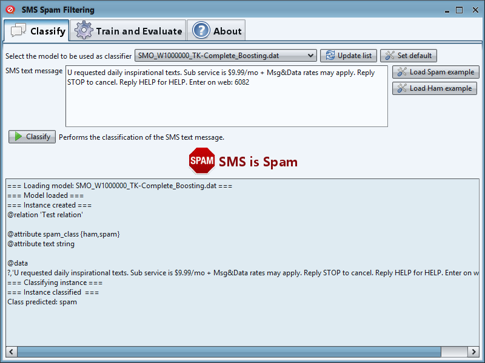
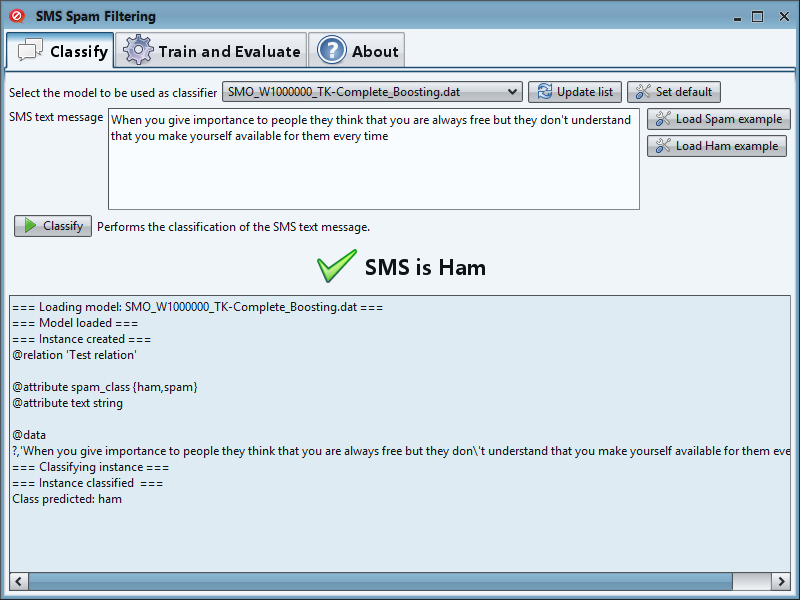
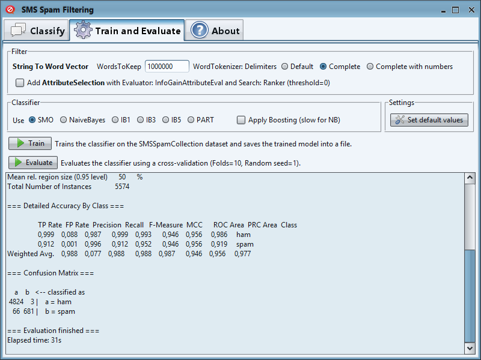

 SMS Spam Filtering
==================

This software was made to study and test several machine learning algorithms for data mining tasks.

The dataset used is [SMS Spam Collection Data Set](http://archive.ics.uci.edu/ml/datasets/SMS+Spam+Collection).

Some of the algorithms provided by [WEKA](http://www.cs.waikato.ac.nz/ml/weka/) were used for the pre-processing, classification and evaluation of the data.

```ARFFBuilder``` class parses the original SMS Spam Collection Data Set to an ARFF file, which is the format used by WEKA. Both files are provided.

```SpamClassifier``` class implements the classification of the SMS text messages and the training and evaluation of a classifier.

The [PDF file](SMS-Spam-Filtering_(Spanish).pdf?raw=true) includes the results of the study and an explanation of the software (only in Spanish).

Every .dat file represents a ```FilteredClassifier```. When you train a classifier on the SMSSpamCollection dataset, the software saves the trained model into a .dat file.

## Download ##
You can [download](SMS-Spam-Filtering.zip?raw=true) the zip file containing only the required files to run the application.

## Screenshots ##




